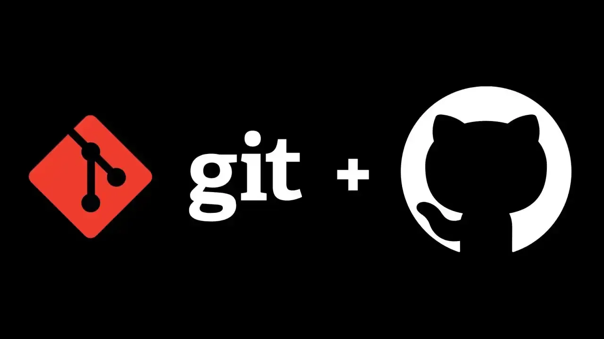

# Curso Git & GitHub

[Comandos mais Usados](#comandos-mais-usados-no-git) | [Lista de Comandos](#lista-de-comandos-do-git) | [Pinheiro Dev](#pinheiro-developer-pythonjs)



## Pinheiro Developer Python/Js

- [linkedin](https://www.linkedin.com/in/pinheirodevpythonjs/)

- [github](https://github.com/PinheiroDevPythonJs)


> **CheckList**

- [ ] Site Portfólio

- [x] linkedin

- [x] GitHub

- [x] Análise e Desenvolvimento de Sistemas

- [x] Courses de Programação

### Lista de Comandos do **Git**:

1.  **git init**

2.  **git add .**

    2.1 git add _nome-do-arquivo_

3.  **git branch -M main**

4.  **git status**

5.  **git commit** -m _"Descrition do Commit"_

    5.1 git commit _nome-do-arquivo_ -m "Descrition do Commit"

6.  **git remote add origin** http://github.com/repositorio

    6.1 git remote -v

7.  **git push -u origin main**

    7.1 git push

    7.2 git push --set-upstream origin _"nome-da-branch"_

8.  **git log**

    8.1 git shortlog

    8.2 git reflog

9.  **git diff**

    9.1 git diff _nome-da-branch_

    9.2 git diff HEAD: _nome-do-arquivo_

    9.3 git diff HEAD: _/pasta/nome-do-arquivo_

10. **git pull**

    10.1 git pull origin main

11. **git branch**

    11.1git branch _nome-da-branch_

    11.2git checkout _nome-da-branch_

    11.3git checkout -b _"nome-da-branch"_

    11.4git branch -r

    11.5git branch -d _nome-da-branch_

12. **git merge**

    12.1 git merge _nome-da-branch_

    12.2 git merge origin/_nome-da-branch_

13. **git restore**

    13.1 git restore _nome-do-arquivo_

    13.2 git restore --staged _nome-do-arquivo_

    13.3 git restore --source=HEAD~2 _nome-do-arquivo_

        _A flag --source diz de onde queres puxar o ficheiro.
        Neste caso, puxa a versão do ficheiro como estava 2 commits atrás (HEAD~2)._

14. **git checkout**

    14.1 git checkout HEAD _nome-do-arquivo_

    14.2 git checkout _nome-da-branch_

15. **git switch**

    15.1 git switch _nome-da-branch_

    15.2 git switch -c _nome-da-branch_

16. **git stash**

    16.1 git stash list

    16.2 git stash apply _number_id-da-stash_

    16.3 git stash show -p _number_id-da-stash_

17. **git tag**

    17.1 git tag -a _nome-da-tag_ -m _"mensagem-sobre-a-versão"_

    17.2 git show _nome-da-tag_

    17.3 git checkout _nome-da-tag_

18. **git push --tags**

    18.1 git push origin _nome-da-tag_

    18.2 git push origin -d _nome-da-tag_

19. **git clone** http://github.com/repositorio

    19.1 git clone http://github.com/repositorio .

20. **git fetch**

    20.1 git fetch origin

    20.2 git fetch -a

    20.3 git fetch -a origin

    20.4 git fetch --all

21. **git gc**

22. **git reset --hard origin/main**

> Neste Readme esta inserido 100% do Conteúdo

> Course Git & GitHub

#### Comandos mais Usados no Git

|           Command           | Description                                        |
| :-------------------------: | -------------------------------------------------- |
|          git init           | Cria a pasta .git dentro do seu Projeto            |
|         git status          | Verifica a Situação atual do seu Repositório       |
|          git add .          | Adiciona e prepara os Arquivos para fazer o Commit |
| git commit -m "description" | Realiza o Commit dos arquivos no Repositório       |
|          git push           | Envia o Repositório local para o GitHub            |

**Exemplo de Function em Js**

```js
function changeName(name) {
    const newName = name;
    return newName;
}

changeName("Pinheiro Developer");
```

**Exemplo de Function em Python**

```python
def change_name (name):
    new_name = name
    return new_name

change_name("Pinheiro Developer")

```
